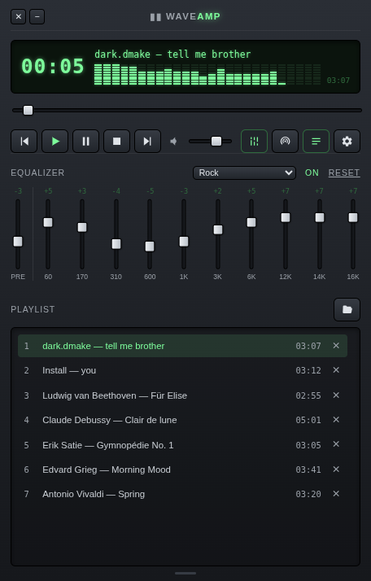
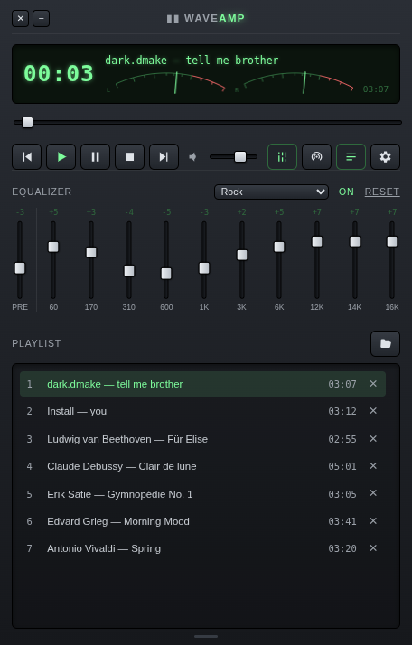
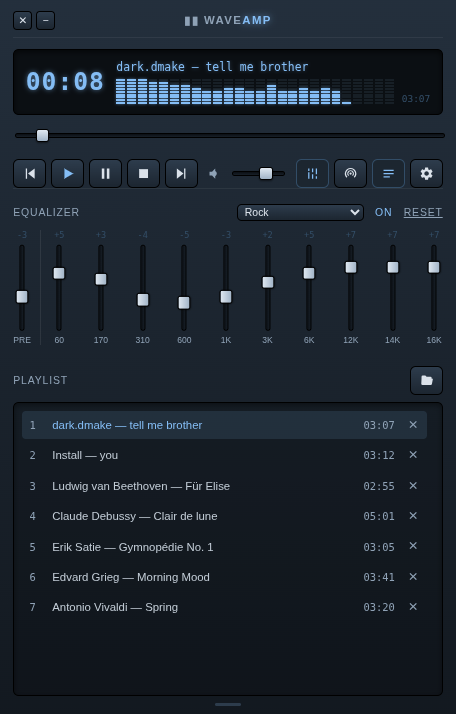
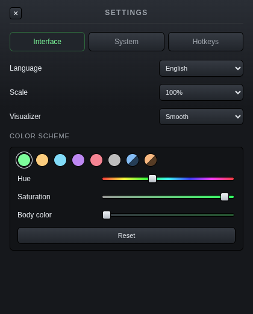

# WaveAMP

**English** | [Русский](README.ru.md)

A retro-style desktop audio player with internet radio, in the spirit of
classic Winamp: dark chrome, a glowing LCD and a real 10-band equalizer.
Runs on macOS, Windows and Linux.

<p align="center">
  
</p>

<p align="center">
  
  
  
</p>

## Features

- **Player** — play, pause, stop, seeking and volume; add local files with a
  button or drag & drop
- **Playlist** — resizable, plays through to the next track automatically
- **Tags** — "Artist — Title" and duration from file tags (ID3, FLAC/Vorbis,
  MP4 and more); legacy Cyrillic (cp1251) and mis-decoded UTF-8 tags are
  repaired
- **Equalizer** — 10 bands (60 Hz–16 kHz) plus preamp, real audio processing
  through the Web Audio API. 18 presets based on the classic Winamp presets,
  with automatic preamp headroom, and a Custom preset that remembers your own
  settings
- **Visualizer** — three modes in the LCD, switched by clicking it: LED
  spectrum, L/R needle meters and an oscilloscope. Smooth or peak response.
  Shows the actual signal, independent of the volume
- **Internet radio** — station search through the
  [Radio Browser API](https://www.radio-browser.info/) with country, region
  and genre filters, plus favorites. The equalizer and visualizer work on radio
  streams too
- **Color scheme** — presets plus hue, saturation and body color sliders
- **Hotkeys** — configurable shortcuts that work on any keyboard layout, with
  optional global hotkeys
- **Media keys and system Now Playing** (macOS Control Center, Windows media
  overlay)
- **Tray icon** with an optional close-to-tray mode
- **HTTP / SOCKS5 proxy** for the radio
- **Automatic updates** from GitHub Releases
- **English and Russian interface**, adjustable UI scale; your playlist,
  equalizer, favorites and layout are restored on the next launch

## Download

Installers are on the [Releases](https://github.com/darkdkl/waveamp/releases/latest)
page; every update of `main` is built and published automatically.

| System | File |
|---|---|
| macOS 13+ (Apple Silicon) | `WaveAMP-<version>-arm64.dmg` |
| Windows 10/11 (x64) | `WaveAMP-Setup-<version>.exe` |
| Linux (x64) | `WaveAMP-<version>.AppImage` |
| Linux (ARM64) | `WaveAMP-<version>-arm64.AppImage` |

The builds aren't signed with a developer certificate, so the system warns
about an unknown publisher on first launch:

- **macOS**: drag WaveAMP to Applications, then clear the quarantine flag macOS
  puts on downloaded files — run in Terminal:

  ```bash
  xattr -cr /Applications/WaveAMP.app
  ```

  Without it macOS may say the app "is damaged" or "can't be verified".
  Alternatively, try to open the app, then go to System Settings → Privacy &
  Security → "Open Anyway".
- **Windows**: "More info" → "Run anyway" in the SmartScreen dialog
- **Linux**: `chmod +x WaveAMP-*.AppImage` before running

## Building from source

Plain HTML/CSS/JS without frameworks or bundlers, plus an Electron shell.
Requires Node.js 20+.

```bash
npm install
npm start
```

Installers:

```bash
npm run build:mac
npm run build:linux
npm run build:win
```

Opening `index.html` directly in a browser gives a limited web version
(no radio, no saved state).

## Feedback

Bug reports and ideas are welcome in [Issues](https://github.com/darkdkl/waveamp/issues) —
see [CONTRIBUTING.md](CONTRIBUTING.md). Security issues: [SECURITY.md](SECURITY.md).

## Third-party libraries

- [Electron](https://www.electronjs.org/) — desktop shell (MIT; Chromium and its
  components under their own licenses)
- [electron-updater](https://github.com/electron-userland/electron-builder) —
  automatic updates (MIT)
- [music-metadata](https://github.com/Borewit/music-metadata) — audio file tags
  (MIT)

The full list with license texts is generated into `THIRD_PARTY_LICENSES.txt`
before every run and build (`npm run licenses`), shipped next to the app and
opened from Settings → System → About.

## License

Copyright © 2026 Dark.Dmake

WaveAMP is free software: you can redistribute it and/or modify it under the
terms of the [GNU General Public License](LICENSE), version 3 or (at your
option) any later version. It comes with no warranty — see the license text.

## Trademarks

Winamp is a trademark of its respective owner. WaveAMP is an independent
project, not affiliated with or endorsed by the owner of Winamp; Winamp is
mentioned here only to describe the player's style and the origin of the
equalizer presets.

## Acknowledgements

Internet radio in WaveAMP is powered by [Radio Browser](https://www.radio-browser.info/) —
a free, non-commercial station database kept running by volunteers who host
its API mirrors at their own expense. Thank you for making it exist and keeping
it open.
